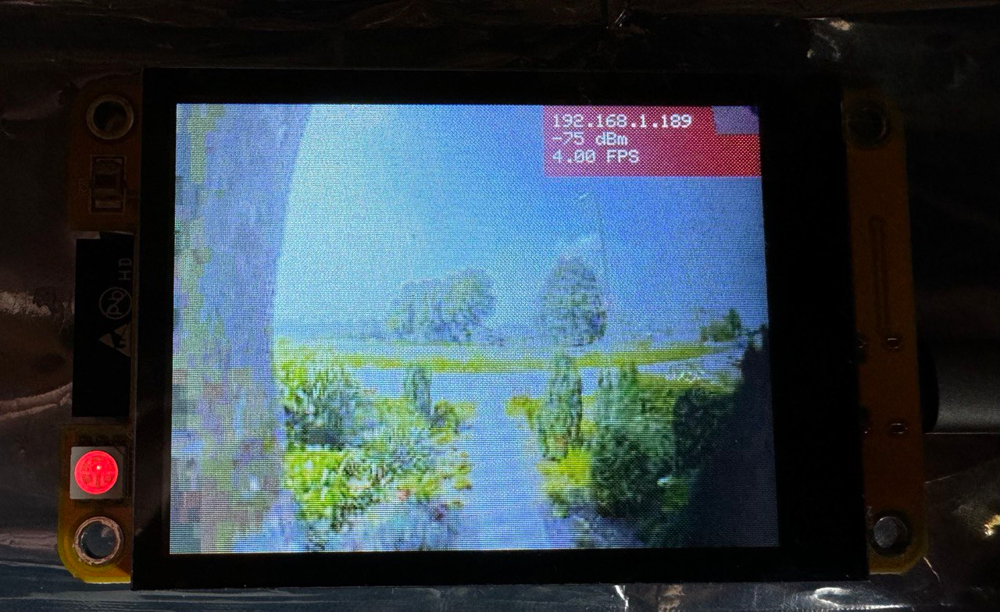

# Ring Doorbell Screen ESP32

This project is a proof of concept (POC) for displaying a live feed from a Ring doorbell on an ESP32 with a TFT display.

## Parts and Components

This setup is designed to run on a single server/computer.

The ESP32 used is an all-in-one package with a display and additional features:

- **Link**: [ESP32 on AliExpress](https://nl.aliexpress.com/item/1005006948064622.html?spm=a2g0o.order_list.order_list_main.5.710679d2Pts8yA&gatewayAdapt=glo2nld)
- **Product**: Guition JC2432W328

To make this project work, a few key parts are needed:

### Part 1: Ring API Interface

**Folder**: [rtsp-proxy](./rtsp-proxy)

While Ring doesn't provide a public API, there are several projects that reverse-engineer this functionality. The best one I found is a Node.js library called [ring-client-api](https://github.com/dgreif/ring/tree/main/packages/ring-client-api). This library provides a way to get a livestream that can be processed using `ffmpeg`. Although it's not the most ideal, it allows streaming to different formats and locations, such as an RTSP server.

### Part 2: RTSP Server

**Folder**: [rtsp-server](./rtsp-server)

I opted to use an RTSP server to facilitate easier processing through existing technologies. For the RTSP server, I used mediamtx.

### Part 3: ESP-Proxy Server

**Folder**: [esp-proxy](./esp-proxy)

To make the ESP display as responsive as possible, I created a proxy server that converts the RTSP stream to a more ESP-friendly format.

### Part 4: ESP Display

**Folder**: [esp-display](./esp-display)

The display gathers individual frames from the ESP-proxy and renders them on the screen. Due to the limited heap space, a compressed JPEG is used.
